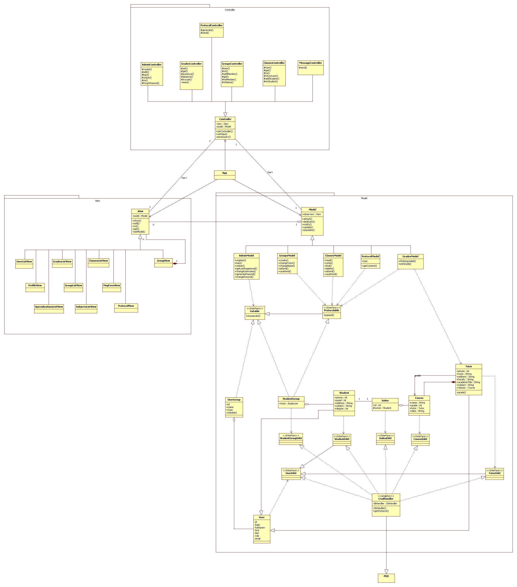

#Diagram klas

- [Diagram klas, grafika](https://raw.githubusercontent.com/rszczers/Indeks/master/CD/cd.jpg)
- [Diagram klas, plik źródłowy](https://github.com/rszczers/Indeks/raw/master/CD/cd.uml)

###Konwencje

Trzymając się zaleceń, diagram wykonany jest we Whitestar UML. 
Tutaj chciałbym zwrócić uwagę na kilka szczegółów. 

Chcąc zaznaczyć implementowanie interfejsu przez klasę, program kreśli linię
ciągłą między klasą a interfejsem. Słuszniej byłoby, jak mi się wydaje, zamiast tego użyć przerywanej linii
zakończonej białym grotem. Dlatego tam gdzie klasy implementują
interfejs uznałem, że rozsądniej będzie zaznaczyć implementację przez
generalizację, niż używać notacji proponowanej przez program.

Smutno, że Whitestar nie umie listować prototypów metod określonych w
interfejsach. Ze względu na to zupełnie niewyraźnie zaznaczone jest na diagramie przejście z wysokopoziomowych modeli do klas,
które zajmują się obsługą bazy danych.

###Szczegóły projektowe

Projekt oparty jest na architekturze MVC. Kontrolery realizują wzorzec
strategii, Widoki – kompozyt, relacja Modele-Widoki – wzorzec obserwer.

Projektując aplikację miałem na uwadze wykonanie jej – tutaj pozwolę sobie na małą krotochwilę – w _technologii php_ i wydaje mi się, że nieznacznie czuć to w kilku miejscach.

Modyfikując odpowiednio pliki htaccess można zmusić serwer Apache do zwrócenia 
url GET'em. URL może niejawnie zawierać nazwę kontrolera, który konieczny jest do
wyświetlenia żądanej przez użytkownika zawartości i argumentów (http://adres/kontroler/argument1/argument2/…).
Klasa Controller zawiera parser url, który odpala odpowiedni kontroler i
przekazuje mu odpowiednie argumenty po wyklikaniu przez użytownika odpowiedniego adresu.
W ten sposób rozdzielamy kod odpowiedzialny za wyświetlanie treści od kodu do
zarządzania nią.

Widoki zorganizowane są w drzewo komponentów. Komponenty (np. GroupListView) są
pewnymi powtarzającymi się elementami strony (formularze, listy itp). Definicje
poszczególnych stron są zakodowane na twardo przy użyciu gotowych komponentów w katalogu
widoków, których diagram nie uwzględnia.

Zlokalizowana centralnie klasa App jest „korzeniem” w tej strukturze. W niej
_inicjalizuje_ się klasa Controller, View i Model.

Z innych szczegółów implementacyjncyh warto zwrócić uwagę na klasę DbHandler,
która dziedziczy z klasy PDO, która w php jest odpowiedzialna za bezpieczną 
obsługę baz danych. 

